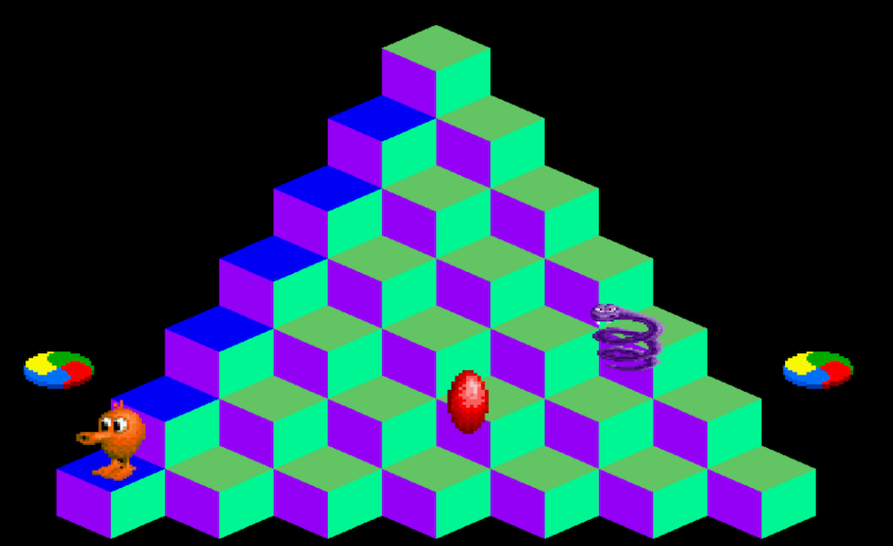

#Qbert

Hey thanks for noticing my game!

After my freshman of college I decided to make a learning experience out of recreating qbert. It took me much longer than I thought it would (as all programming projects go), but I am very happy to say that I have brought it this far!

Looking back there are so many things I would have done differently, but I designed my code before I knew anything about SDL. Once again, this was a learning exercise and I am happy calling this product "complete".

If you are one of my friends who want to play just shoot me a text/email!